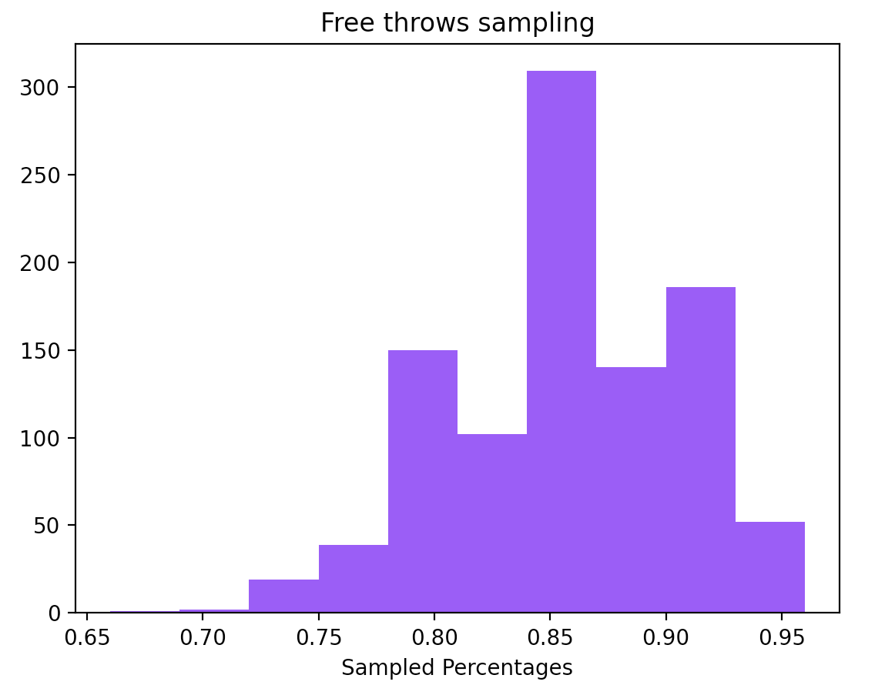

Hypothesis or statistical testing is a really useful method in statistics that allows us to investigate and measure the validity of our assumptions. 

Let's assume that a basketball player claims that his free throw percentage is $85\%$ and that's why we challenged him to prove it. After 50 free throws he ended up scoring 38 of them leading to a percentage of $76\%$. Can we safely assume that this person is lying and that his actual ratio is lower than $85\%$?

One way to test something like that is to use a computer to run a simulation several times and see how many times we actually had a percentage less or equal than $76\%$. Indeed we tested it by running 1000 times a binomial distribution with $p=0.85$ and it seems that only 22 out of 1000 trials such a thing happened. A $2.2\%$ seems to be really small and maybe that is an indicator that in fact this person lies.

We could also compute the confidence interval for such an experiment is $(0.751\%, 0.949\%)$ which is quite large interval, but it seems that 75\% is already out of the confidence interval.

Statisticians have streamlined this process by introducing what is called **Statistical Hypothesis Testing**.

In this context the first step is to make a hypothesis of exactly the opposite of what we are trying to prove. This is called the **Null Hypothesis** denoted by $H_0$ and an **Alternative Hypothesis** denoted by $H_1$. e.g. in the above case the null hypothesis would be that We assume that normal free throw ratio is $\mu = \mu_0 = 85\%$ and the alternative hypothesis is that the normal free throw ratio is $\mu < 85\%$.

The second step is to calculate a test-function. Where we compute an unbiased sampled mean $\bar{\mu}$ and we compute the statistical function:
$$ z = \frac{\bar{\mu} - \mu_0}{s_{\bar{\mu}}} $$

The $z$ function is a regularized value. If the Null Hypothesis was true, then $z$ follows the standard normal distribution. The further $z$ is from 0 then the higher unlikely is that the null hypothesis is not true. 

That's where the third step comes into play where we have to compute the P-value. P-value is the probability that this test function has such a value considering what we were able to sample.

The fourth step is to decide if we are going to reject the null hypothesis based on the $P-value$ we calculated. 

- $P-value < \alpha$: We reject the null hypothesis
- $P-value \geq \alpha$: We fail reject the null hypothesis

where $\alpha$ is the significance level of the test.

# Places met

- Linear regression: P-value indicating whether a predictor is relevant or not with the target variable
- AB-test: Compare the means between two different populations

# Well known tests

- **T-test**
    - **Independent Samples T-Test**: Used when comparing the means of two independent groups. For example, you might use it to compare the test scores of two different classes.
    - **Paired Samples T-Test**: Used when comparing the means of related groups, often before and after some intervention. For instance, you could use it to compare the weights of individuals before and after a weight loss program.
    - **One-Sample T-Test**: Used to determine if the mean of a single sample differs significantly from a known or hypothesized population mean
- **Chi-Square Test**: Used to assess the association between categorical variables. It's often used for comparing observed and expected frequencies in a contingency table.
- **ANOVA (Analysis of Variance)**: Used to compare means among more than two groups. It tells you whether there are statistically significant differences between the means of multiple groups.
